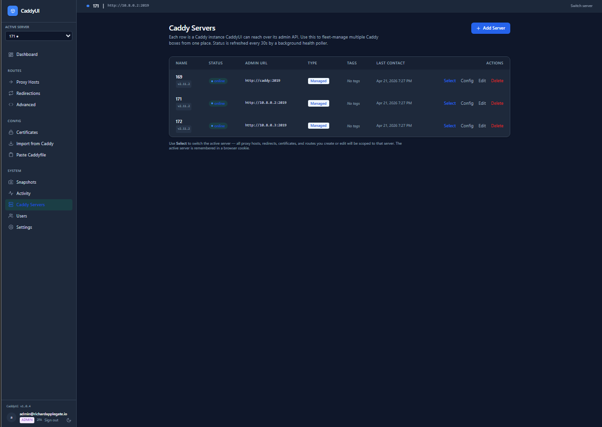
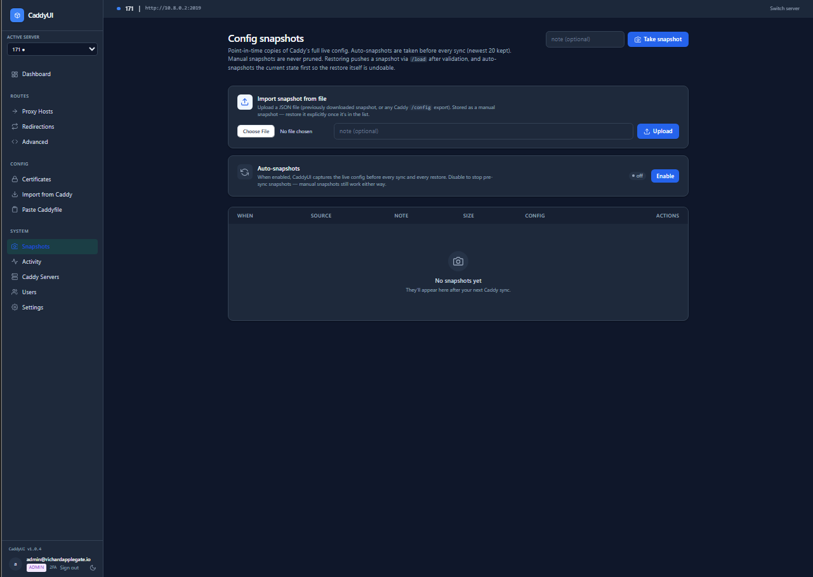
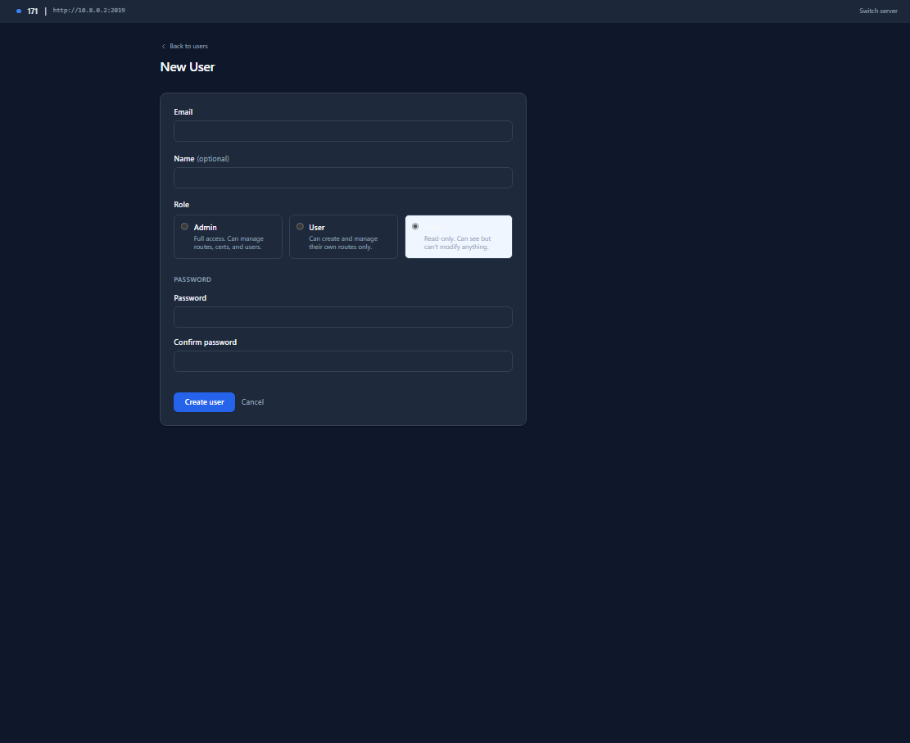
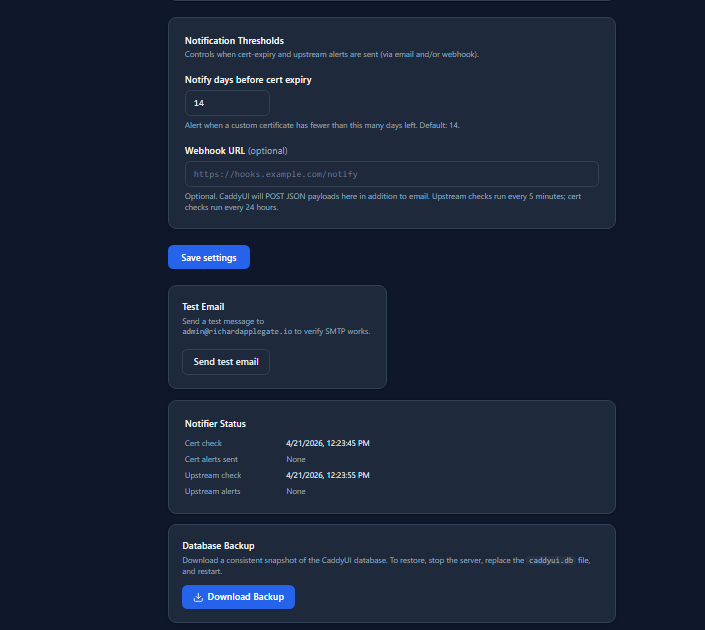

# Caddy UI

A modern, self-hosted web UI for [Caddy](https://caddyserver.com/) — manage proxy hosts, redirections, SSL certificates, and advanced routes through a clean interface, without touching config files.

[](LICENSE)
[](https://hub.docker.com/r/applegater/caddyui)
[](https://hub.docker.com/r/applegater/caddyui)
[](https://go.dev/)

---

## 🐳 Install

```bash
docker pull applegater/caddyui:latest
```

Multi-arch: `linux/amd64` + `linux/arm64` (runs on your Raspberry Pi). SBOM + provenance signed. Non-root (UID 10001).

See the [Quick Start](#quick-start) below for the full `docker-compose.yml`.

---

## Screenshots

| Dashboard | Proxy Hosts |
|-----------|-------------|
|  |  |

| Edit Proxy Host | Certificates |
|-----------------|--------------|
|  |  |

| Caddy Servers | Snapshots |
|---------------|-----------|
|  |  |

| User Management | Settings & Notifications |
|-----------------|--------------------------|
|  |  |

---

## Features

### Routing

- **Proxy Hosts** — point domains at upstream services with one-click TLS via Caddy's automatic HTTPS
- **Redirections** — 301/302/307/308 redirect rules across hostnames
- **Advanced Routes** — import raw Caddyfile blocks or write JSON directly for anything the UI can't model
- **Certificates** — upload and manage custom PEM / path-based certificates; expiry alerts via email or webhook
- **Managed DNS (Cloudflare)** — create the A / AAAA record for a new proxy host without leaving CaddyUI; zone lookup is automatic from the domain
- **Paste Caddyfile** — convert a Caddyfile block into a managed advanced route
- **Import from Caddy** — pull your existing live Caddy config into the DB on first run
- **Branded error pages** — CaddyUI-styled 404 / 502 / 503 / 504 pages are injected into Caddy automatically

### Multi-server

- **Remote Caddy management** — manage multiple Caddy instances from a single UI; switch with a dropdown. Edge hosts only need Caddy — no CaddyUI container required (see [Agent mode](#agent-mode-edge-only-caddy-no-caddyui))
- **Per-server scoping** — proxy hosts, redirections, routes, and certificates are all scoped to the active server; cross-server conflicts can't happen

### Access control

- **Three-role RBAC** — `admin` (full control), `user` (manage their own resources), `view` (read-only). Admin-only pages: Users, Groups, Settings, Caddy Servers, Snapshots
- **Per-user ownership** — proxy hosts, redirections, advanced routes, and certificates each belong to one user; only the owner (and admins) can edit or delete them. Admins can reassign ownership from any resource's edit form
- **Groups** *(v2.7.4)* — admin bundles `user`-role accounts into a team; every member sees every other member's resources in their list views (read-only), with a `Team` chip so it's clear which rows are "mine" vs. "my teammate's"
- **2FA / TOTP** — per-user time-based one-time passwords
- **Login CAPTCHA** — optional Cloudflare Turnstile or reCAPTCHA v3 gate on the login form

### Observability

- **Visitor analytics** *(v2.7.0)* — opt-in per-host traffic counters; top hosts, 24 h sparkline, status-code mix, unique visitors. Per-server filter for multi-Caddy fleets
- **Upstream health** — live health check per proxy; polls Caddy's own admin API so Docker-internal hostnames work correctly
- **App health** — detects whether the upstream actually responds, not just whether its TCP port is open
- **Activity log** — every create / edit / delete / sync action is logged with actor, timestamp, and resource

### Operational

- **Snapshots** — one-click SQLite database backup; auto-snapshot on sync
- **Email notifications** — SMTP support (STARTTLS / TLS / plain) for cert-expiry and upstream-health alerts
- **Webhook notifications** — generic JSON POST for cert-expiry (pair with any notifier that accepts webhooks)
- **Update notifications** — sidebar badge when a newer Docker Hub release is available
- **Dark mode** — toggleable, remembers your choice; system preference respected on first visit
- **PWA** — installable on desktop and mobile; offline-capable service worker

---

## Quick Start

### Docker Compose (recommended)

```yaml
services:
  caddy:
    image: caddy:2-alpine
    container_name: caddyui-caddy
    restart: unless-stopped
    ports:
      - "80:80"
      - "443:443"
      - "443:443/udp"
    volumes:
      - caddy_data:/data
      - caddy_config:/config
    environment:
      CADDY_ADMIN: 0.0.0.0:2019
    command: caddy run --config /config/caddy/autosave.json --resume --adapter json
    networks:
      - caddyui

  caddyui:
    image: applegater/caddyui:latest
    container_name: caddyui
    restart: unless-stopped
    depends_on:
      - caddy
    ports:
      - "8081:8080"
    volumes:
      - caddyui_data:/data
    environment:
      CADDYUI_DB: /data/caddyui.db
      CADDYUI_LISTEN: :8080
      CADDY_ADMIN_URL: http://caddy:2019
    networks:
      - caddyui

volumes:
  caddy_data:
  caddy_config:
  caddyui_data:

networks:
  caddyui:
    driver: bridge
```

Open **http://localhost:8081** and complete the first-run setup (create an admin account).

### Docker Run (standalone)

```bash
docker run -d \
  --name caddyui \
  -p 8081:8080 \
  -v caddyui_data:/data \
  -e CADDY_ADMIN_URL=http://your-caddy-host:2019 \
  applegater/caddyui:latest
```

### Agent mode (edge-only Caddy, no CaddyUI)

For multi-host setups you only need **one** CaddyUI container. Every other
host — the "agent" or "edge" nodes — runs only Caddy, and the central CaddyUI
manages them remotely through Caddy's admin API (typically tunneled over
WireGuard or Tailscale).

On each edge host:

```yaml
services:
  caddy:
    image: caddy:2-alpine
    container_name: caddy
    restart: unless-stopped
    # --resume is required so admin-API pushes persist across Caddy restarts.
    command: caddy run --config /config/caddy/autosave.json --resume --adapter json
    ports:
      # Bind the admin API to your private tunnel IP (WireGuard / Tailscale).
      # Do NOT expose :2019 on a public interface.
      - "10.8.0.2:2019:2019"
      - "80:80"
      - "443:443"
      - "443:443/udp"
    volumes:
      - caddy_data:/data
      - caddy_config:/config

volumes:
  caddy_data:
  caddy_config:
```

Then in the central CaddyUI, go to **System → Caddy Servers → Add Server** and
point it at `http://10.8.0.2:2019` (or whatever private address the edge listens
on). All proxy hosts, certificates, and routes for that edge are managed from
the central UI — no database, no UI container, no extra port to expose on the
edge.

> **Why `--resume`?** In default mode Caddy loads only the Caddyfile at boot
> and discards anything pushed to the admin API. With `--resume` Caddy boots
> from `autosave.json` (the last live config it received via the admin API),
> so CaddyUI's pushes survive `docker compose restart`.

---

## Environment Variables

| Variable | Default | Description |
|---|---|---|
| `CADDYUI_DB` | `/data/caddyui.db` | Path to the SQLite database |
| `CADDYUI_LISTEN` | `:8080` | Listen address |
| `CADDY_ADMIN_URL` | `http://caddy:2019` | Caddy admin API base URL |
| `CADDYFILE_PATH` | `/etc/caddy/Caddyfile` | Path to Caddyfile (optional) |
| `CADDYUI_SYNC_ON_START` | *(unset)* | Set to `1` to push DB state to Caddy on startup |

---

## Configuration

All configuration is done through the web UI. No config files needed beyond the environment variables above.

### First Run

1. Open the UI at your configured port.
2. Create the first admin account via the setup wizard.
3. The bootstrap Caddy server is automatically added (using `CADDY_ADMIN_URL`).
4. Add additional Caddy servers under **System → Caddy Servers**.

### SMTP Notifications

Configure under **System → Settings → Email (SMTP)**:

- Supports STARTTLS (port 587), implicit TLS (port 465), and plain (port 25)
- Cert-expiry emails fire once per 24 h per domain when within the configured threshold
- Upstream health emails fire on state change (healthy → down, down → recovered), checked every 5 minutes

### Multi-Server

Add additional Caddy instances under **System → Caddy Servers**. Switch the active server with the dropdown in the sidebar. All proxy hosts, redirections, routes, and certificates are scoped per server.

Edge / remote hosts do **not** need to run a CaddyUI container — just Caddy with its admin API reachable over a private network (WireGuard, Tailscale, VPC). See [Agent mode](#agent-mode-edge-only-caddy-no-caddyui) for the minimal compose file.

---

## Building from Source

```bash
git clone https://github.com/X4Applegate/caddyui.git
cd caddyui
go build -o caddyui ./cmd/caddyui
./caddyui
```

### Docker Build

```bash
docker build --build-arg VERSION=v1.0.0 -t caddyui:v1.0.0 .
```

### Dependencies

- [Go 1.24+](https://go.dev/)
- [Caddy 2.x](https://caddyserver.com/) with the admin API enabled (default)
- No external database required — uses embedded SQLite

---

## Architecture

```
cmd/caddyui/        Entry point, env config, startup
internal/
  auth/             Session, password hashing, TOTP
  caddy/            Admin API client, Caddyfile parser, importer
  db/               SQLite init & migrations
  models/           Data types and DB queries
  server/           HTTP handlers, routes, notifiers, health poller
web/
  templates/        Go html/template pages
  static/           CSS, icons, PWA manifest & service worker
```

CaddyUI stores all state in a single SQLite file. It communicates with Caddy exclusively through Caddy's HTTP admin API — no SSH, no file manipulation.

---

## Upgrading

1. Pull the new image tag from Docker Hub.
2. Recreate the container (Portainer: **Recreate** → enable **Re-pull image**; CLI: `docker compose pull && docker compose up -d`).
3. Database migrations run automatically on startup.
4. Check the [CHANGELOG](CHANGELOG.md) for any breaking changes.

---

## AI Assistance Disclosure

This project is developed with assistance from **Claude (Anthropic)**. Claude helps with debugging, feature implementation, code review, and documentation. All code is reviewed and tested by the project maintainer before release.

Bug reports and issues are triaged by the maintainer with Claude's assistance. If you find a bug, please open an issue — it will be looked at.

> **Note on privacy:** No proprietary code, credentials, database contents, or user data are ever shared with Claude. Only code structure and logic are discussed.

---

## License

[CaddyUI Source Available License 1.0](LICENSE)

- **Free** for personal use — homelab, home server, VPS, or any individual self-hosting.
- **Free** for non-profits, educational institutions, and small businesses (< 50 employees and < $5M revenue).
- **Free** for any organization using it internally (not reselling it).
- **Commercial license required** to offer CaddyUI as a hosted/managed service.

---

## Contributing

See [CONTRIBUTING.md](CONTRIBUTING.md).

## Security

See [SECURITY.md](SECURITY.md) for how to report vulnerabilities.

## Code of Conduct

See [CODE_OF_CONDUCT.md](CODE_OF_CONDUCT.md).
