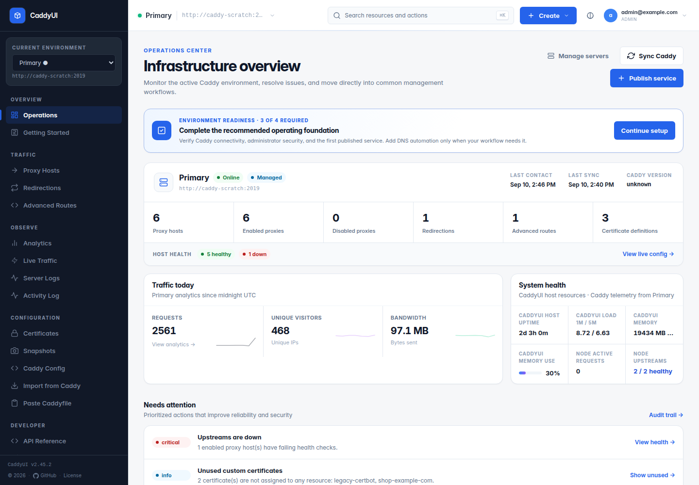
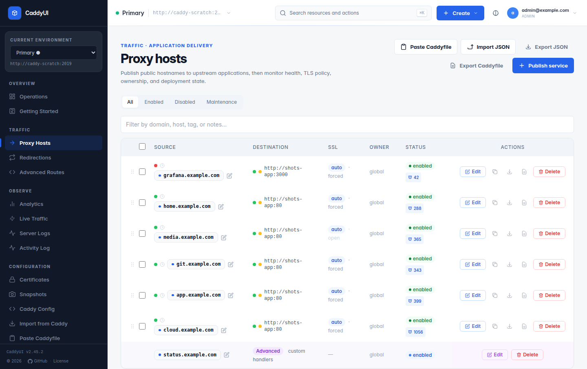
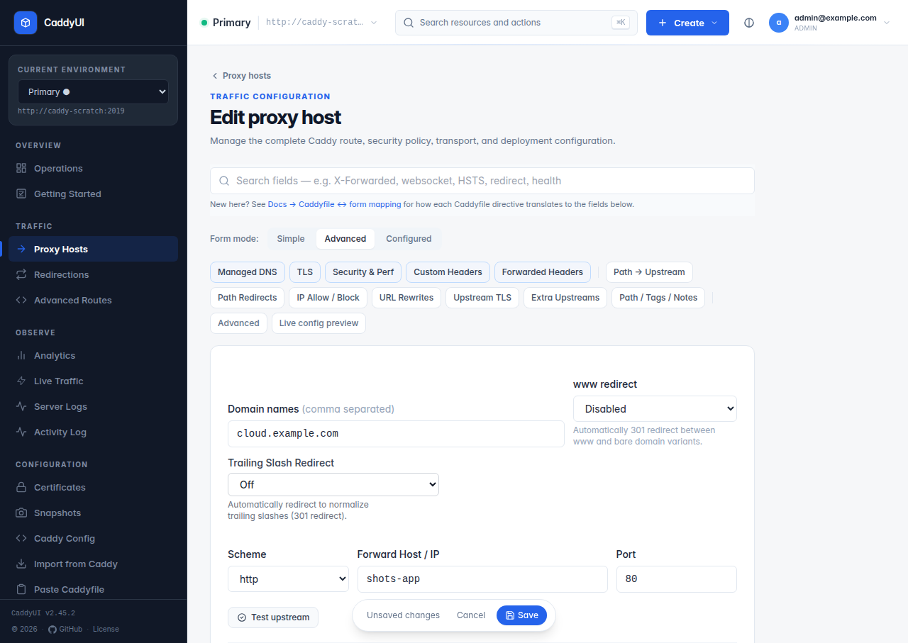
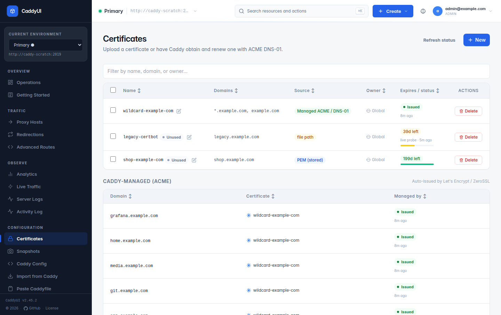
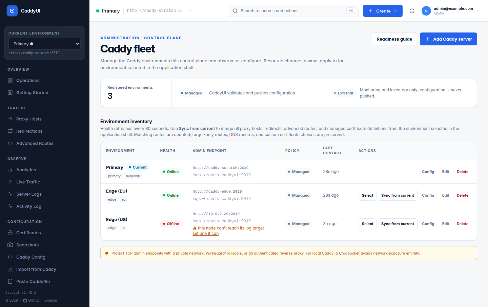
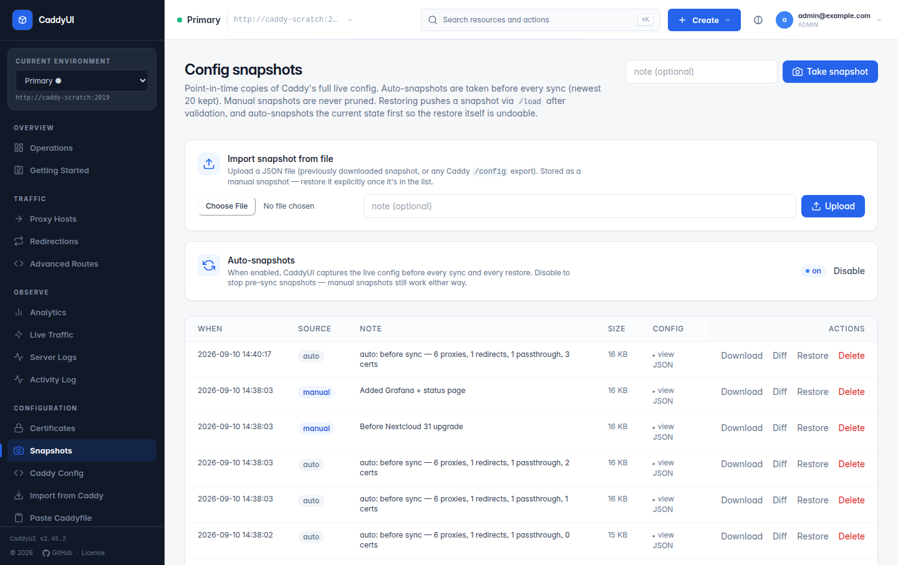
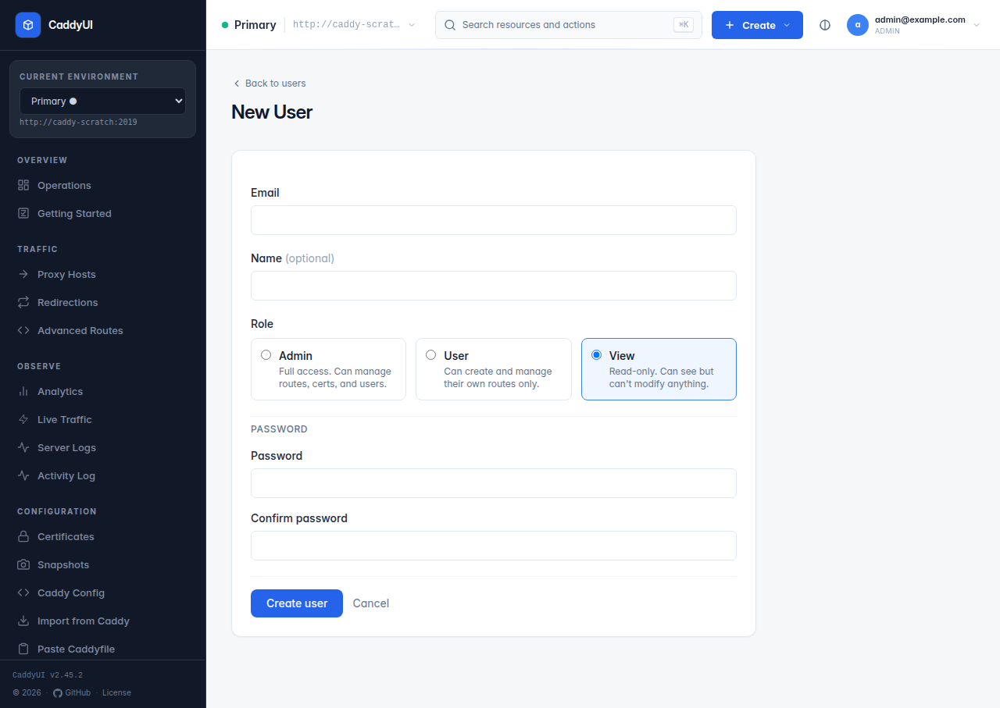
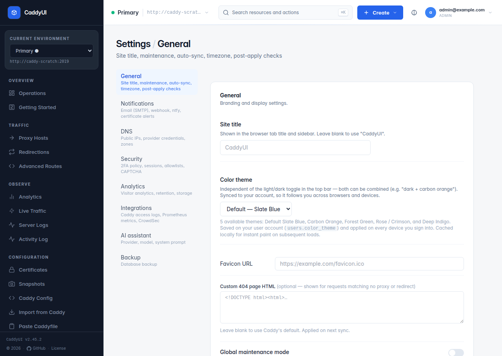

# Caddy UI

A modern, self-hosted web UI for [Caddy](https://caddyserver.com/) — manage proxy hosts, redirections, SSL certificates, and advanced routes through a clean interface, without touching config files.

[](LICENSE)
[](https://hub.docker.com/r/applegater/caddyui)
[](https://hub.docker.com/r/applegater/caddyui)
[](https://go.dev/)

---

## 🐳 Install

```bash
docker pull applegater/caddyui:latest
```

Multi-arch: `linux/amd64` + `linux/arm64` (runs on your Raspberry Pi). SBOM + provenance signed. Non-root (UID 10001).

See the [Quick Start](#quick-start) below for the full `docker-compose.yml`.

---

## Screenshots

| Dashboard | Proxy Hosts |
|-----------|-------------|
|  |  |

| Edit Proxy Host | Certificates |
|-----------------|--------------|
|  |  |

| Caddy Servers | Snapshots |
|---------------|-----------|
|  |  |

| User Management | Settings & Notifications |
|-----------------|--------------------------|
|  |  |

---

## Features

### What's new in v2.12

- **⌘K / Ctrl+K command palette** — global search across every proxy host, redirection, raw route, and certificate. `↑/↓ Enter Esc`. Color-coded type pills. *(v2.11.5)*
- **Bulk multi-select on every list page** — checkbox + select-all + floating Enable / Disable / Delete bar on `/proxy-hosts`, `/redirection-hosts`, `/raw-routes`, and `/certificates`. *(v2.11.6, .9, .10)*
- **Drag-to-reorder rows** — HTML5 ⠿ handle on `/proxy-hosts` and `/redirection-hosts`. *(v2.11.11)*
- **Live route-JSON preview** on the proxy-host edit form — see the exact Caddy route JSON your form would push, refreshing as you type. *(v2.11.13)*
- **Multi-server health widget** on the dashboard — one card per registered Caddy server with status, host count, version, last seen. *(v2.11.16)*
- **AI assistant — bring your own backend** *(v2.11.15, v2.12.36+)* — opt-in floating chat button that answers Caddy / TLS / DNS questions and writes production-grade Caddyfile snippets on demand. Pick any backend in Settings → AI assistant: **Ollama (local)** for fully-offline on your GPU, **Ollama Cloud** for hosted MoE models that won't fit on a homelab card (qwen3-coder:480b, gpt-oss:120b, etc.), **Anthropic Claude** (Haiku 4.5 / Sonnet 4.6 / Opus 4.7), or **any OpenAI-compatible API** (also covers OpenRouter, Groq, Together, vLLM, LM Studio). Conversation memory (multi-turn), markdown rendering, and a custom system prompt setting are shared by every backend.
- **AI auto-fill — chat your hosts into existence** *(v2.12.11+)* — describe what you want in plain English (*"set up nextcloud at cloud.example.com pointing to nextcloud:80"*, *"redirect old.example.com to new.example.com permanently"*) and the assistant emits a structured `create_proxy_host(...)` / `create_redirection(...)` tool call. The chat panel renders a confirmation card with the exact arguments — click **Apply** and the resource is created, the form is filled in for you, and Caddy is auto-synced. Every AI-driven exec writes an `ai_tool_call` activity-log entry so admins can audit what the AI did. Works on Claude 4.x, GPT-4, qwen2.5+, llama3.1+, and gemma2.
- **Wildcard cert auto-issuance via DNS-01** — type `*.example.com` in Domains, CaddyUI emits the `tls.automation.policies` block using your existing Cloudflare token (caveat: needs `caddy-dns/cloudflare` plugin in your Caddy build). *(v2.11.19)*
- **Per-hostname DNS-record pre-flight** on multi-domain routes — checklist showing which records will be created vs already exist. *(v2.12.1)*
- **Managed DNS on redirections** — closes the long-standing gap where redirects had no DNS plumbing. Now creates A records per hostname on save, deletes on row removal. *(v2.12.2)*
- **Per-section Save buttons on Settings** — no more scroll-to-bottom for a one-toggle change. *(v2.12.6)*
- **Active-server-scoped dashboard cards** — Requests / Visitors / Bandwidth Today now reflect only the server selected in the picker, including traffic to wildcard SAN hostnames. *(v2.12.8, v2.12.9)*

### Routing

- **Proxy Hosts** — point domains at upstream services with one-click TLS via Caddy's automatic HTTPS
- **Redirections** — 301/302/307/308 redirect rules across hostnames; path-based rules with `redirect_rules`; sunset-date 410 conversion; wildcard subdomain capture
- **Advanced Routes** — import raw Caddyfile blocks or write JSON directly for anything the UI can't model
- **Certificates** — upload and manage custom PEM / path-based certificates; expiry alerts via email or webhook (covers Caddy-managed ACME / Let's Encrypt certs too via daily TLS dial since *v2.11.14*)
- **Managed DNS** — create the A record for a new proxy host, redirection, or advanced route without leaving CaddyUI; auto-deleted when the row is removed. Providers: **Cloudflare, DigitalOcean, Hetzner, Porkbun, GoDaddy, Namecheap**. Zone lookup is automatic from the domain.
- **Paste Caddyfile import** — convert a Caddyfile into managed proxy hosts / redirections / advanced routes; smart classifier auto-routes each block to the right table *(v2.10.7+)*. Re-classify button rescues older imports
- **Import from Caddy** — pull your existing live Caddy config into the DB on first run
- **Per-host options surface (~70 fields)** — request / response headers (X-Forwarded-*, security headers, cache hints), path-based upstream overrides, multi-upstream routing, active health checks, upstream TLS settings, request blocking (deny by path / query / user-agent / method)
- **Branded error pages** — CaddyUI-styled 404 / 502 / 503 / 504 pages are injected into Caddy automatically

### Multi-server

- **Remote Caddy management** — manage multiple Caddy instances from a single UI; switch with a dropdown. Edge hosts only need Caddy — no CaddyUI container required (see [Agent mode](#agent-mode-edge-only-caddy-no-caddyui))
- **Per-server scoping** — proxy hosts, redirections, routes, and certificates are all scoped to the active server; cross-server conflicts can't happen

### Access control

- **Three-role RBAC** — `admin` (full control), `user` (manage their own resources), `view` (read-only). Admin-only pages: Users, Groups, Settings, Caddy Servers, Snapshots
- **Per-user ownership** — proxy hosts, redirections, advanced routes, and certificates each belong to one user; only the owner (and admins) can edit or delete them. Admins can reassign ownership from any resource's edit form
- **Groups** *(v2.7.4)* — admin bundles `user`-role accounts into a team; every member sees every other member's resources in their list views (read-only), with a `Team` chip so it's clear which rows are "mine" vs. "my teammate's"
- **2FA / TOTP** — per-user time-based one-time passwords
- **Login CAPTCHA** — optional Cloudflare Turnstile or reCAPTCHA v3 gate on the login form

### Observability

- **Visitor analytics** *(v2.7.0)* — opt-in per-host traffic counters; top hosts, 24 h sparkline, status-code mix, unique visitors. Per-server filter for multi-Caddy fleets
- **Upstream health** — live health check per proxy; polls Caddy's own admin API so Docker-internal hostnames work correctly
- **App health** — detects whether the upstream actually responds, not just whether its TCP port is open
- **Activity log** — every create / edit / delete / sync action is logged with actor, timestamp, and resource

### Operational

- **Snapshots** — one-click SQLite database backup; auto-snapshot on sync
- **Email notifications** — SMTP support (STARTTLS / TLS / plain) for cert-expiry and upstream-health alerts
- **Webhook notifications** — generic JSON POST for cert-expiry (pair with any notifier that accepts webhooks)
- **Update notifications** — sidebar badge when a newer Docker Hub release is available
- **Dark mode** — toggleable, remembers your choice; system preference respected on first visit
- **PWA** — installable on desktop and mobile; offline-capable service worker

---

## AI Assistant

CaddyUI ships an opt-in chat assistant that knows the entire CaddyUI surface area — every page, every Settings field, every proxy-host form section — and can both **answer questions** about Caddy / TLS / DNS and **auto-fill new resources for you** via tool calling.

### Pick a backend

Go to **Settings → AI assistant** and choose one of:

| Backend | Best for | What you need |
|---|---|---|
| **Ollama (local)** | Fully-offline, runs on your GPU, no cloud calls | An Ollama container reachable from CaddyUI; recommended models: `qwen2.5:14b`, `qwen2.5-coder:14b`, `gemma2:9b`, `llama3.1:8b` |
| **Ollama Cloud** | Hosted MoE models that won't fit on a homelab GPU | API key from [ollama.com/settings/keys](https://ollama.com/settings/keys); models: `qwen3-coder:480b-cloud`, `gpt-oss:120b`, `deepseek-v3.1:671b` |
| **Anthropic Claude** | Strongest reasoning + Caddy knowledge out of the box | API key from [console.anthropic.com](https://console.anthropic.com); models: `claude-haiku-4-5-20251001` (fast), `claude-sonnet-4-6` (balanced), `claude-opus-4-7` (max) |
| **OpenAI-compatible** | OpenAI itself, OpenRouter, Groq, Together, self-hosted vLLM, LM Studio | Base URL + API key + model name |

Switching providers preserves the inactive providers' credentials, so you can flip back and forth without re-entering keys.

### What you can ask

**Knowledge questions** — the assistant has the full CaddyUI app map in its system prompt, so it points you at the *exact page → section → field* for whatever you're trying to do:

> *"How do I strip the X-Powered-By header globally?"*  
> → Settings → General → Globally stripped response headers.

> *"Where do I configure SSE flushing?"*  
> → Proxy host form → Timeouts → Stream flush interval ms (use `-1`).

**Caddyfile help** — production-grade snippets, not 3-line stubs. The default system prompt steers the model toward `encode zstd gzip` + path blocking + security headers + the `X-Forwarded-*` trio. Strip back to minimum only when you ask for *"just the basics"*.

### AI auto-fill (tool calling)

Describe what you want and the assistant calls a tool to create it:

> *"Set up nextcloud at cloud.example.com pointing to nextcloud:80 with auto-SSL"*  
> → emits `create_proxy_host(domains="cloud.example.com", forward_host="nextcloud", forward_port=80, ssl_enabled=true, ssl_forced=true)`.

The chat panel renders a **confirmation card** with the exact arguments. You click **Apply** and CaddyUI:

1. Creates the proxy host (or redirection).
2. Auto-syncs Caddy with the new config.
3. Writes an `ai_tool_call` row to the activity log so admins can see exactly what happened.

Tools currently available:

- `create_proxy_host(domains, forward_scheme, forward_host, forward_port, ssl_enabled, ssl_forced)`
- `create_redirection(domains, forward_scheme, forward_domain, forward_http_code, preserve_path)`

Models with native tool support — Claude 4.x, GPT-4 / GPT-4o, qwen2.5+, llama3.1+, gemma2 — will use these. Older or smaller models silently ignore the tools field and just chat.

### Custom system prompt

If you want a different persona, in-house naming conventions, or a leaner / chattier voice, paste your own steering text into **Settings → AI assistant → Custom system prompt**. Leaving it blank uses the built-in default that has the full CaddyUI knowledge map and the production-grade Caddyfile examples.

### Privacy

API keys are stored in CaddyUI's SQLite database. The Settings UI never renders saved keys back to the form (a `••••••••` placeholder shows when one is set; leave the field blank to keep the existing key). Local Ollama means the conversation never leaves your machine; cloud backends send the conversation to your chosen provider per their respective terms.

---

## Quick Start

### Docker Compose (recommended)

```yaml
services:
  caddy:
    image: caddy:2-alpine
    container_name: caddyui-caddy
    restart: unless-stopped
    ports:
      - "80:80"
      - "443:443"
      - "443:443/udp"
    volumes:
      - caddy_data:/data
      - caddy_config:/config
    environment:
      CADDY_ADMIN: 0.0.0.0:2019
    command: caddy run --config /config/caddy/autosave.json --resume --adapter json
    networks:
      - caddyui

  caddyui:
    image: applegater/caddyui:latest
    container_name: caddyui
    restart: unless-stopped
    depends_on:
      - caddy
    ports:
      - "8081:8080"
    volumes:
      - caddyui_data:/data
    environment:
      CADDYUI_DB: /data/caddyui.db
      CADDYUI_LISTEN: :8080
      CADDY_ADMIN_URL: http://caddy:2019
    networks:
      - caddyui

volumes:
  caddy_data:
  caddy_config:
  caddyui_data:

networks:
  caddyui:
    driver: bridge
```

Open **http://localhost:8081** and complete the first-run setup (create an admin account).

### Docker Run (standalone)

```bash
docker run -d \
  --name caddyui \
  -p 8081:8080 \
  -v caddyui_data:/data \
  -e CADDY_ADMIN_URL=http://your-caddy-host:2019 \
  applegater/caddyui:latest
```

### Agent mode (edge-only Caddy, no CaddyUI)

For multi-host setups you only need **one** CaddyUI container. Every other
host — the "agent" or "edge" nodes — runs only Caddy, and the central CaddyUI
manages them remotely through Caddy's admin API (typically tunneled over
WireGuard or Tailscale).

On each edge host:

```yaml
services:
  caddy:
    image: caddy:2-alpine
    container_name: caddy
    restart: unless-stopped
    # --resume is required so admin-API pushes persist across Caddy restarts.
    command: caddy run --config /config/caddy/autosave.json --resume --adapter json
    ports:
      # Bind the admin API to your private tunnel IP (WireGuard / Tailscale).
      # Do NOT expose :2019 on a public interface.
      - "10.8.0.2:2019:2019"
      - "80:80"
      - "443:443"
      - "443:443/udp"
    volumes:
      - caddy_data:/data
      - caddy_config:/config

volumes:
  caddy_data:
  caddy_config:
```

Then in the central CaddyUI, go to **System → Caddy Servers → Add Server** and
point it at `http://10.8.0.2:2019` (or whatever private address the edge listens
on). All proxy hosts, certificates, and routes for that edge are managed from
the central UI — no database, no UI container, no extra port to expose on the
edge.

> **Why `--resume`?** In default mode Caddy loads only the Caddyfile at boot
> and discards anything pushed to the admin API. With `--resume` Caddy boots
> from `autosave.json` (the last live config it received via the admin API),
> so CaddyUI's pushes survive `docker compose restart`.

---

## Environment Variables

| Variable | Default | Description |
|---|---|---|
| `CADDYUI_DB` | `/data/caddyui.db` | Path to the SQLite database |
| `CADDYUI_LISTEN` | `:8080` | Listen address |
| `CADDY_ADMIN_URL` | `http://caddy:2019` | Caddy admin API base URL |
| `CADDYFILE_PATH` | `/etc/caddy/Caddyfile` | Path to Caddyfile (optional) |
| `CADDYUI_SYNC_ON_START` | *(unset)* | Set to `1` to push DB state to Caddy on startup |

---

## Configuration

All configuration is done through the web UI. No config files needed beyond the environment variables above.

### First Run

1. Open the UI at your configured port.
2. Create the first admin account via the setup wizard.
3. The bootstrap Caddy server is automatically added (using `CADDY_ADMIN_URL`).
4. Add additional Caddy servers under **System → Caddy Servers**.

### SMTP Notifications

Configure under **System → Settings → Email (SMTP)**:

- Supports STARTTLS (port 587), implicit TLS (port 465), and plain (port 25)
- Cert-expiry emails fire once per 24 h per domain when within the configured threshold
- Upstream health emails fire on state change (healthy → down, down → recovered), checked every 5 minutes

### Multi-Server

Add additional Caddy instances under **System → Caddy Servers**. Switch the active server with the dropdown in the sidebar. All proxy hosts, redirections, routes, and certificates are scoped per server.

Edge / remote hosts do **not** need to run a CaddyUI container — just Caddy with its admin API reachable over a private network (WireGuard, Tailscale, VPC). See [Agent mode](#agent-mode-edge-only-caddy-no-caddyui) for the minimal compose file.

---

## Building from Source

```bash
git clone https://github.com/X4Applegate/caddyui.git
cd caddyui
go build -o caddyui ./cmd/caddyui
./caddyui
```

### Docker Build

```bash
docker build --build-arg VERSION=v1.0.0 -t caddyui:v1.0.0 .
```

### Dependencies

- [Go 1.24+](https://go.dev/)
- [Caddy 2.x](https://caddyserver.com/) with the admin API enabled (default)
- No external database required — uses embedded SQLite

---

## Architecture

```
cmd/caddyui/        Entry point, env config, startup
internal/
  auth/             Session, password hashing, TOTP
  caddy/            Admin API client, Caddyfile parser, importer
  db/               SQLite init & migrations
  models/           Data types and DB queries
  server/           HTTP handlers, routes, notifiers, health poller
web/
  templates/        Go html/template pages
  static/           CSS, icons, PWA manifest & service worker
```

CaddyUI stores all state in a single SQLite file. It communicates with Caddy exclusively through Caddy's HTTP admin API — no SSH, no file manipulation.

---

## Upgrading

1. Pull the new image tag from Docker Hub.
2. Recreate the container (Portainer: **Recreate** → enable **Re-pull image**; CLI: `docker compose pull && docker compose up -d`).
3. Database migrations run automatically on startup.
4. Check the [CHANGELOG](CHANGELOG.md) for any breaking changes.

---

## AI Assistance Disclosure

This project is developed with assistance from **Claude (Anthropic)**. Claude helps with debugging, feature implementation, code review, and documentation. All code is reviewed and tested by the project maintainer before release.

Bug reports and issues are triaged by the maintainer with Claude's assistance. If you find a bug, please open an issue — it will be looked at.

> **Note on privacy:** No proprietary code, credentials, database contents, or user data are ever shared with Claude. Only code structure and logic are discussed.

---

## License

[CaddyUI Source Available License 1.0](LICENSE)

- **Free** for personal use — homelab, home server, VPS, or any individual self-hosting.
- **Free** for non-profits, educational institutions, and small businesses (< 50 employees and < $5M revenue).
- **Free** for any organization using it internally (not reselling it).
- **Commercial license required** to offer CaddyUI as a hosted/managed service.

---

## Contributing

See [CONTRIBUTING.md](CONTRIBUTING.md).

## Security

See [SECURITY.md](SECURITY.md) for how to report vulnerabilities.

## Code of Conduct

See [CODE_OF_CONDUCT.md](CODE_OF_CONDUCT.md).
